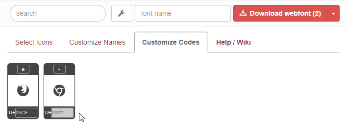

# Changing the input password bullet

### This repo provides instructions & a simple demo showing how to replace the input password bullet in most browsers.

* Go to [Fontello](http://fontello.com/), or equivalent site.
* Choose or upload an icon.

    

* Select "Customize Codes" tab.
* Change the glyph destination to U+"2022" to replace the bullet symbol in webkit browsers.
* Change the glyph destination to U+"25CF" to replace the bullet symbol in Firefox & MS Edge.

    

* Download webfont.
* Include the font files on your site, and include the following css (Note, the `0000` will change depending on the glyph & glyph destination)

```css
/* Use the css below to change the password input symbol */
@font-face {
	font-family: 'fontello';
	src: url('./font/fontello.eot?0000');
	src: url('./font/fontello.eot?0000#iefix') format('embedded-opentype'),
	     url('./font/fontello.woff2?0000') format('woff2'),
	     url('./font/fontello.woff?0000') format('woff'),
	     url('./font/fontello.ttf?0000') format('truetype'),
	     url('./font/fontello.svg?0000#fontello') format('svg');
	font-weight: normal;
	font-style: normal;
}

input[type="password"] {
	font-family: "fontello";
	font-style: normal;
	font-weight: normal;
	speak: none;

	/* For safety - reset parent styles, that can break glyph codes*/
	font-variant: normal;
	text-transform: none;

	/* Font smoothing. That was taken from TWBS */
	-webkit-font-smoothing: antialiased;
	-moz-osx-font-smoothing: grayscale;
	/* Uncomment for 3D effect */
	/* text-shadow: 1px 1px 1px rgba(127, 127, 127, 0.3); */

	/* add spacing to better separate each image */
	letter-spacing: 2px;
}
```

* [Check out the demo](https://mottie.github.io/input-password-bullet/)

    
    
